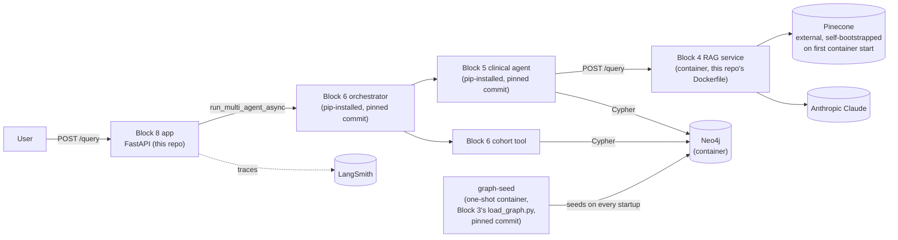

# genai-block8-capstone

Flagship end-to-end agentic app — integrates a graph knowledge base, RAG retrieval, and a hardened multi-agent system into one deployed, observable pipeline.

This repo doesn't rebuild anything from Blocks 3-6. It's the glue: an entry point, deployment config, CI/CD, and an observability view over what those blocks already produce. See `docs/spec.md` for the full scope and reasoning.

## Architecture

Four containers (`docker-compose.yml`): this repo's own app, Block 4's RAG service (built from a pinned commit, Dockerfile owned here), a one-shot Neo4j seeding step (re-running Block 3's pinned, idempotent `load_graph.py`), and Neo4j itself. Pinecone and Anthropic/Claude are external hosted services - not containerized, but the RAG service bootstraps its own Pinecone index on first start if it's found empty, so a fresh clone only needs a valid API key, not a pre-populated index.

## Running it

1. `cp .env.example .env` and fill in real credentials (see table below).
2. `docker-compose up` - builds and starts all four containers. First run bootstraps the Pinecone index (~1 minute) and seeds Neo4j from Block 3's committed CSVs.
3. `curl -X POST http://localhost:8000/query -H "Content-Type: application/json" -d '{"condition":"Essential hypertension","lab":"SBP","comparison":"above","value":140,"drug_a":"Lisinopril","drug_b":"Amlodipine"}'`

## Operational notes

- **Rotating `NEO4J_PASSWORD`:** Neo4j only reads `NEO4J_AUTH` (which `docker-compose.yml` builds from `.env`'s `NEO4J_USER`/`NEO4J_PASSWORD`) when it initializes an empty database. The `neo4j_data` volume persists across `docker compose up`/`down`, so changing `NEO4J_PASSWORD` in `.env` after the first run has no effect — Neo4j keeps the old credentials, the healthcheck fails, and `graph-seed`/`app` never start. Run `docker compose down -v` first (this drops `neo4j_data`, so the graph reseeds from `graph-seed` on the next `up`), then change the password and start again.

## Required environment variables

| Variable | Where to get it |
|---|---|
| `PINECONE_API_KEY` | [app.pinecone.io](https://app.pinecone.io) → API Keys |
| `PINECONE_INDEX_NAME` | A name you choose - the RAG service creates the index automatically if it doesn't exist |
| `ANTHROPIC_API_KEY` | [console.anthropic.com](https://console.anthropic.com) → API Keys |
| `NEO4J_USER` | Fixed value `neo4j` - the Neo4j Docker image doesn't support renaming the initial user |
| `NEO4J_PASSWORD` | A password you choose - used for the local Neo4j container's auth |
| `NEO4J_DATABASE` | Defaults to `neo4j`, no need to change |
| `LANGCHAIN_API_KEY` | [smith.langchain.com](https://smith.langchain.com) → Settings → API Keys |
| `LANGCHAIN_TRACING_V2` | Defaults to `true` - enables LangSmith tracing |
| `LANGCHAIN_PROJECT` | A name you choose to group traces under in LangSmith - defaults to `block8-capstone` |

## Testing

- `pytest` - Phase 1's mocked contract tests for this repo's own entry point. Fast, no live calls.
- `pytest tests/integration` - real end-to-end tests against a running `docker-compose up` stack. Needs real credentials; makes real, paid Anthropic/Pinecone calls.
- CI (`.github/workflows/ci.yml`) runs on every push: this repo's own tests, plus Block 5 and Block 6's own stubbed test/eval suites re-run against this repo's combined, pinned dependency set (proves the three-repo combination doesn't introduce a version conflict - not a re-litigation of tests already passing in their own CI). The live-secrets integration job only runs on a push to `main` or a PR targeting `main`, since it costs real money per run.

## Observability

Per-run tracing is LangSmith, reused as-is (see `LANGCHAIN_PROJECT` above) - nothing new built for that. `python observability/report.py` (after at least one real `/query` call) surfaces Block 5/6's existing cost, token, latency, and outcome-mode logging in one place.

Block 7's query-size/runtime/retry signals are not included yet: as of this phase, Block 7 has no logging implementation on its real `main` (or any branch) to surface - it's still at the spec/plan/tasks stage. See "What I'd do next" below.

## Threat model

Pending Block 7. This section will link to Block 7's `SECURITY.md` once that block is finished and merged.

## Spec and plan

- [`docs/spec.md`](docs/spec.md) - scope, architecture, acceptance criteria
- [`docs/plan.md`](docs/plan.md) - phase breakdown and reasoning
- [`docs/tasks.md`](docs/tasks.md) - concrete per-phase checklists

## AI-assisted workflow

Built with [Claude Code](https://claude.com/claude-code), following spec-driven development throughout: `docs/spec.md` → `docs/plan.md` → `docs/tasks.md` → code, each phase on its own branch with its own PR, reviewed before the next began. Verification was a standing rule, not a one-off: every phase re-checked the spec's code-level claims (function signatures, import paths, env vars, CI behavior) against the real, current code in every repo it touched, before building anything - and it found real, non-cosmetic drift more than once, not just typos:

- Phase 1 found Block 6's own pin on `block5_agent` floating on `@main` rather than a commit, contradicting the spec's claim of an established never-float policy - left as-is (out of scope for this repo), flagged for separate follow-up.
- Phase 1 also found `genai-block6-multiagent` had no packaging metadata at all, so it couldn't be `pip install`ed as this repo's spec required - resolved by opening a small, packaging-only PR against that repo first (mirroring a prior, identical fix already done for Block 5), rather than silently working around it here.
- Phase 2's decision on whether to bootstrap Pinecone on every container start or only when empty was made from an actual measurement (a cold bootstrap timed at about a minute), not a guess.
- Phase 3 confirmed Block 7 has no observability logging anywhere yet, not even on an unmerged branch, before building the observability view around that fact rather than assuming the spec's description was already true.
- A review pass on the compose config found a real startup-ordering race: `app` could start before `rag-service`/`graph-seed` had actually finished, since `depends_on` only waited for those containers to *start*, not to become healthy or complete - fixed with a real healthcheck (`curl` against Block 4's own `/docs`) and explicit `service_healthy`/`service_completed_successfully` conditions, verified live by polling a fresh `docker-compose up` and confirming `app` stayed unreachable for the whole window until both conditions were actually met.
- The same pass found `block4_entrypoint.py`'s Pinecone check only caught one exception type (`NotFoundException`) - a bad `PINECONE_API_KEY` crashed with a raw traceback instead of a clear error. Broadened to catch `PineconeException` and print a one-line diagnostic, verified live with a real invalid key.
- `.env` (real secrets) was being sent to the Docker daemon as build context on every `docker build`, despite nothing `COPY`ing it into an image - fixed with a `.dockerignore`.
- The CI workflow hardcoded Block 6's pinned commit a second time, separately from `requirements.txt`'s own pin, with nothing keeping the two in sync - fixed by parsing the commit out of `requirements.txt` itself at CI time instead of duplicating it.

Corrections along the way: an early Dockerfile for this repo's own app was missing `git`, which `pip` needs to clone a git-pinned dependency - caught by actually running `docker compose build`, not assumed to work from the Dockerfile's contents. An early integration test asserted on a RAG query shape that didn't match how the real calling code (Block 5's `rag_tool.py`) actually queries Block 4 - caught by comparing the test's request body against the real caller's code, not by guessing a plausible-looking payload.

Decisions made and why: FastAPI over a CLI entry point (Phase 2's compose-stack reachability and integration tests need an HTTP call, not a container exec); this repo's entry point package named `app/` rather than `scripts/` (Block 6's own installed package already claims the top-level import name `scripts`, confirmed by installing it into a real virtualenv rather than assumed from its directory name); a static, run-on-demand observability script rather than a small always-on page (single-operator project, no one else needs concurrent access to a handful of aggregate numbers).

## What I'd do next

- Bump the `block6_multiagent` pin once its packaging PR merges to `main` (currently pinned to that PR's own branch - see `requirements.txt`'s comment).
- Fix Block 6's own floating `block5_agent` pin (flagged in Phase 1, not fixed here - out of scope for this repo).
- Add Block 7's query-size/runtime/retry signals to the observability view once Block 7 actually ships that logging.
- Link Block 7's real `SECURITY.md` once that block merges, replacing the placeholder above.
- Consider a small retention/rotation policy for `data/eval/run_log.jsonl` before it's used somewhere it needs to run unattended for a long time - it currently grows unbounded.
